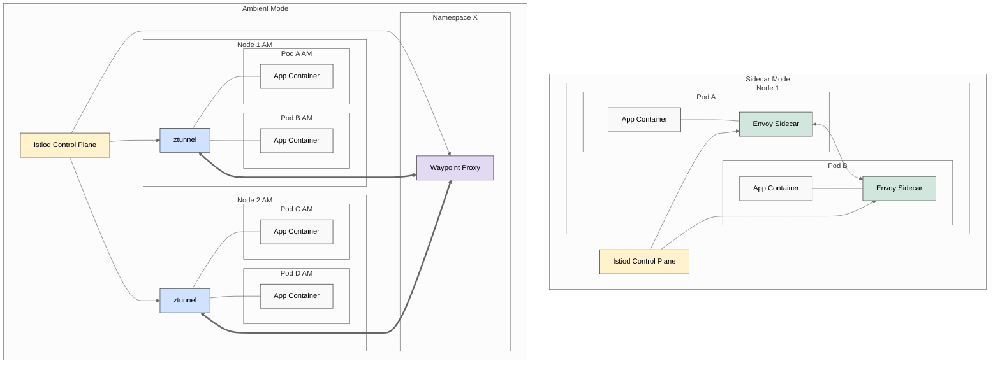

Last year in November, Istio’s Ambient Mode reached General Availability with 1.24. But do you know how it compares with the Sidecar mode and what’s better for you and how the architecture compare?

Understanding Istio SideCar vs Ambient Mode is essential to unlock the value.

In Istio's traditional sidecar architecture, each application pod runs alongside an Envoy proxy that handles all network traffic. This battle-tested approach has been around since Istio's first release in 2017.

→ The main challenge? Resource overhead. With one sidecar per pod, a cluster with 1,000 pods requires 1,000 sidecars consuming CPU and RAM. By default, Istio recommends allocating 0.1 CPU cores and 128MB of memory per sidecar.

→ Operational complexity is another pain point. Upgrading Istio requires restarting every application pod to update the sidecar version so your application would have been down while upgrading the mesh. 

Ambient mode introduces a split architecture that breaks the sidecar into two distinct components:

→ Ztunnel (Zero-Trust Tunnel): For L4 Operations that runs on each node, creating a secure mTLS overlay between different nodes via itself. 

→ Waypoint Proxy: Basically Envoy proxy deployed at the namespace level that enables advanced traffic management (l7) features when needed. Acts as a communication channel between Ztunnel when enabled with the help of Ambient Mode. 

So by breaking them you can choose your components and remove the entire overhead of sidecars. For example, just required mTLS? Use Ztunnel and not the entire stack, while using up to 73% less CPU than sidecar mode. The Benefits?

→ Less Resource Consumption and Cost Savings
→ Reduced disruption as upgrades can be selectively rolled out without affecting the entire application
→ Configure L7/L4 as needed according to requirements with a modular architecture.

Features like multi-cluster, multi-network, and VM support are still in development (track progress on GitHub issues like #54245), but my take is that Ambient Mode’s lightweight design and cost efficiency make it a game-changer for scaling clusters without breaking the bank.

