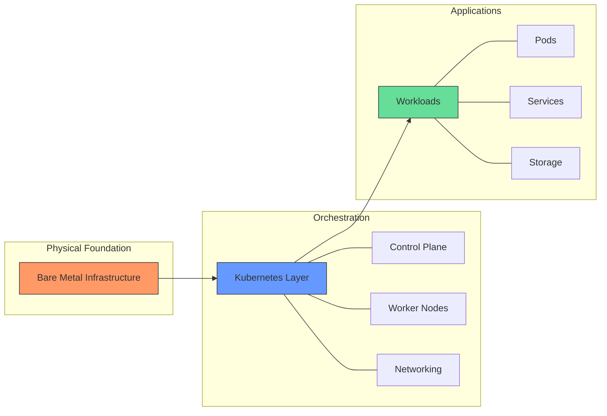

You've decided bare metal is the way to go for your Kubernetes clusters! 💪 Awesome choice for performance and control. But where do you even begin?

Getting started can seem complex, but breaking it down helps. Here’s what you need to nail:

→ Hardware Selection: This is crucial! Do your workloads need a few beefy, GPU-accelerated nodes, or many lower-spec machines? Balance performance, your desired utilization rate, and, of course, your budget. 

→ Software Stack:

→ →  Operating System: Your OS is key for security and consistency. Go for popular, easily securable options with strong community support like CentOS, Ubuntu, or Talos.

→ →  Essential Tools: Keep your runtimes, monitoring tools, and cluster management software updated to maintain a solid security posture.

→ Networking Setup:

→ → Solutions: Explore options like overlay networks (e.g., flannel) or CNI-based solutions (e.g., Calico, Cilium) to bootstrap your cluster and bolster security. 

→ → Exposing Services: If you need to make services available outside the cluster, a load balancer like MetalLB can distribute traffic effectively.

→ →  Security Alert: Network security needs extra attention here. Misconfigured firewalls or access controls can leave your cluster vulnerable.

→ Cluster Management Tools:

Get friendly with kubectl for managing your cluster and kubeadm for setting it up efficiently. These tools are your bread and butter for adding/removing nodes, upgrading K8s versions, and managing workloads. 

→ Monitoring (Your Superpower!):

→ → Tools: Leverage Prometheus, Grafana Labs, and Elasticsearch to get clear insights into your cluster's health.

→ → Data-Driven Ops: Manage events, metrics, and logs to optimize workloads and swiftly resolve issues. Automation here is your friend. 

Taking the bare metal route gives you incredible power, but it demands careful planning in these core areas. Get these right, and you're on your way to a high-performing K8s setup! 

Tip: If you want multiple clusters distributed to your teams and don't want to manage isolation complexity in-house, using virtual clusters can be helpful. Learn how to Run Multiple Kubernetes on Bare Metal with vCluster: http://bit.ly/3SiZHRH

