🚀 Bare metal is making a serious comeback, especially for Kubernetes! But when is ditching the VMs for raw hardware really the right move for your K8s clusters? 🤔

It's a hot topic, and many are surprised by the clear advantages in specific scenarios. If you're nodding along, here’s a quick breakdown:

🎯 𝗕𝗮𝗿𝗲 𝗠𝗲𝘁𝗮𝗹 𝗦𝗵𝗶𝗻𝗲𝘀 𝗪𝗵𝗲𝗻:

→ 𝗠𝗮𝘅𝗶𝗺𝘂𝗺 𝗣𝗲𝗿𝗳𝗼𝗿𝗺𝗮𝗻𝗰𝗲 𝗶𝘀 𝗮 𝗠𝘂𝘀𝘁: Direct hardware access means minimal hypervisor overhead and no noisy neighbors hogging resources. Your critical tasks get full infrastructure capacity.

→ 𝗬𝗼𝘂 𝗡𝗲𝗲𝗱 𝗟𝗼𝘁𝘀 𝗼𝗳 𝗜𝗻𝗳𝗿𝗮 𝗙𝗹𝗲𝘅𝗶𝗯𝗶𝗹𝗶𝘁𝘆: Got specialized, too new, or too old hardware? Bare metal handles it. Access different kernels and fully leverage unique hardware capabilities (like specific network cards)

→ 𝗬𝗼𝘂 𝗪𝗮𝗻𝘁 𝗙𝘂𝗹𝗹 𝗖𝗼𝗻𝘁𝗿𝗼𝗹 𝗼𝗳 𝗦𝗲𝗰𝘂𝗿𝗶𝘁𝘆: Single tenancy reduces the attack surface. No hypervisor vulnerabilities to worry about, plus you control kernel updates, encryption, and can use hardening frameworks like SELinux/AppArmor.

→ 𝗬𝗼𝘂 𝗡𝗲𝗲𝗱 𝗠𝗮𝘅𝗶𝗺𝘂𝗺 𝗡𝗲𝘁𝘄𝗼𝗿𝗸 𝗣𝗲𝗿𝗳𝗼𝗿𝗺𝗮𝗻𝗰𝗲: Fewer abstractions mean better network speeds. Tools like CNI, flannel, and Calico make setup and routing smoother, and troubleshooting is often simpler.

→ 𝗬𝗼𝘂 𝗪𝗮𝗻𝘁 𝘁𝗼 𝗖𝗼𝗻𝘁𝗿𝗼𝗹 𝗖𝗼𝘀𝘁𝘀: Optimal resource utilization and predictable scaling costs can lead to significant savings-up to 30% TCO reduction in some cases! Plus, no hypervisor licensing fees.

🚧 𝗕𝘂𝘁, 𝗜𝘁'𝘀 𝗡𝗼𝘁 𝗔𝗹𝘄𝗮𝘆𝘀 𝗦𝗺𝗼𝗼𝘁𝗵 𝗦𝗮𝗶𝗹𝗶𝗻𝗴. 𝗧𝗵𝗲 𝗖𝗵𝗮𝗹𝗹𝗲𝗻𝗴𝗲𝘀:

→ 𝗢𝗽𝗲𝗿𝗮𝘁𝗶𝗼𝗻𝗮𝗹 𝗖𝗼𝗺𝗽𝗹𝗲𝘅𝗶𝘁𝘆: Forget "click-and-go." Provisioning, updates, networking, DNS, storage, and scaling are all on you. OS patching and certificate management? Your responsibility.

→ 𝗢𝗽𝘁𝗶𝗼𝗻𝗮𝗹𝗶𝘁𝘆 𝗢𝘃𝗲𝗿𝗹𝗼𝗮𝗱: The "blank slate" can be daunting. Choosing and ensuring compatibility for OS, interfaces, and hardening solutions requires careful planning and dedicated team resources.

Choosing bare metal for K8s isn't a decision to take lightly, but for the right workloads, the benefits are undeniable! Learn more in my post here: https://lnkd.in/gqFduUsN

```mermaid
graph TD
    subgraph "Bare Metal Kubernetes"
        A[Applications] --> B[Kubernetes]
        B --> C[Operating System]
        C --> D[Physical Hardware]
    end
    
    subgraph "Virtualized Kubernetes"
        E[Applications] --> F[Kubernetes]
        F --> G[Guest OS]
        G --> H[Hypervisor]
        H --> I[Host OS]
        I --> J[Physical Hardware]
    end
    
    style A fill:#f9f,stroke:#333,stroke-width:2px
    style E fill:#f9f,stroke:#333,stroke-width:2px
    style B fill:#bbf,stroke:#333,stroke-width:2px
    style F fill:#bbf,stroke:#333,stroke-width:2px
    style D fill:#dfd,stroke:#333,stroke-width:2px
    style J fill:#dfd,stroke:#333,stroke-width:2px
    style H fill:#fdd,stroke:#333,stroke-width:2px

```

