```mermaid
graph TD
    subgraph "Bare Metal Kubernetes"
        A[Applications] --> B[Kubernetes]
        B --> C[Operating System]
        C --> D[Physical Hardware]
    end
    
    subgraph "Virtualized Kubernetes"
        E[Applications] --> F[Kubernetes]
        F --> G[Guest OS]
        G --> H[Hypervisor]
        H --> I[Host OS]
        I --> J[Physical Hardware]
    end
    
    style A fill:#f9f,stroke:#333,stroke-width:2px
    style E fill:#f9f,stroke:#333,stroke-width:2px
    style B fill:#bbf,stroke:#333,stroke-width:2px
    style F fill:#bbf,stroke:#333,stroke-width:2px
    style D fill:#dfd,stroke:#333,stroke-width:2px
    style J fill:#dfd,stroke:#333,stroke-width:2px
    style H fill:#fdd,stroke:#333,stroke-width:2px

```

🚀 Bare metal is making a serious comeback, especially for Kubernetes! But when is ditching the VMs for raw hardware really the right move for your K8s clusters? 🤔

It's a hot topic, and many are surprised by the clear advantages in specific scenarios. If you're nodding along, here’s a quick breakdown.

🎯 Bare Metal Shines When:

→ Maximum Performance is a Must: Direct hardware access means minimal hypervisor overhead and no noisy neighbors hogging resources. Your critical tasks get full infrastructure capacity.

→ You Need Lots of Infra Flexibility: Got specialized, too new, or too old hardware? Bare metal handles it. Access different kernels and fully leverage unique hardware capabilities (like specific network cards)

→ You Want Full Control of Security: Single tenancy reduces the attack surface. No hypervisor vulnerabilities to worry about, plus you control kernel updates, encryption, and can use hardening frameworks like SELinux/AppArmor.

→ You Need Maximum Network Performance: Fewer abstractions mean better network speeds. Tools like CNI, flannel, and Calico make setup and routing smoother, and troubleshooting is often simpler.

→ You Want to Control Costs: Optimal resource utilization and predictable scaling costs can lead to significant savings-up to 30% TCO reduction in some cases! Plus, no hypervisor licensing fees.

🚧 But, It's Not Always Smooth Sailing. The Challenges:

→ Operational Complexity: Forget "click-and-go." Provisioning, updates, networking, DNS, storage, and scaling are all on you. OS patching and certificate management? Your responsibility.

→ Optionality Overload: The "blank slate" can be daunting. Choosing and ensuring compatibility for OS, interfaces, and hardening solutions requires careful planning and dedicated team resources.

Choosing bare metal for K8s isn't a decision to take lightly, but for the right workloads, the benefits are undeniable!

Learn more in my post here: https://lnkd.in/gqFduUsN

