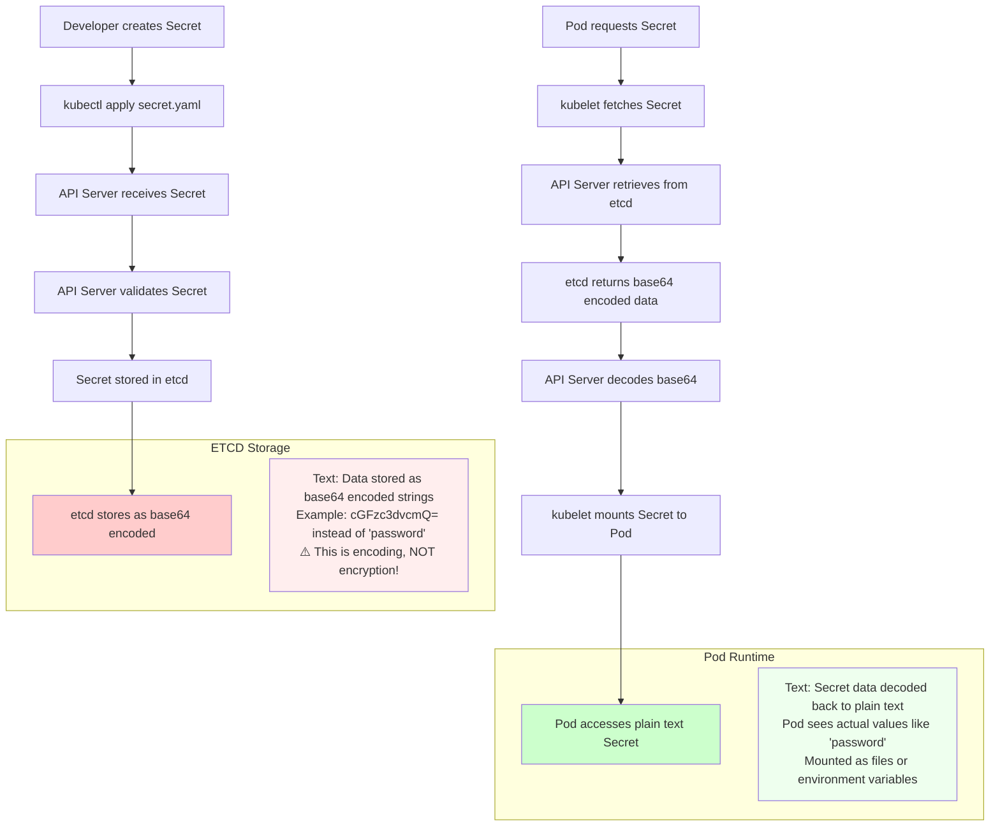

Kubernetes Secrets are a critical security component that many developers misunderstand, leading to potential vulnerabilities. The fundamental distinction between encoding and encryption is crucial for maintaining proper security posture in your cluster.

𝗘𝗻𝗰𝗼𝗱𝗲𝗱 != 𝗘𝗻𝗰𝗿𝘆𝗽𝘁𝗲𝗱 ⚠️

→ Encoding (base64): Just data format conversion - NOT security! Anyone can decode It by reading ETCD 📖

→ Encryption: Real protection with encryption keys 🔒

The key difference is that encoding simply transforms data into a different format (like base64) for storage and transmission purposes, while encryption uses cryptographic algorithms and keys to actually protect the data from unauthorized access.

𝗪𝗵𝗮𝘁 𝗶𝘀 𝗮 𝗞𝟴𝘀 𝗦𝗲𝗰𝗿𝗲𝘁? 🔐

→ Special object storing sensitive data (passwords, API keys, tokens, docker registry secrets or TLS)

→ Keeps secrets out of your code & Pod specs

→ Reduces accidental exposure risk

→ Default K8s = encoded only (stored in etcd)

Kubernetes Secrets provide a mechanism to separate sensitive information from application code and configuration, but by default, they only provide encoding, not true encryption.

𝗪𝗵𝘆 𝘁𝗵𝗶𝘀 𝗺𝗮𝘁𝘁𝗲𝗿𝘀? 💡

→ Encoding = "hidden" but not protected

→ Encryption = actually safe, even if etcd is compromised

Without proper encryption at rest, anyone with access to the etcd datastore can easily decode base64-encoded secrets and access sensitive information.

𝗞𝗲𝗲𝗽 𝘀𝗲𝗰𝗿𝗲𝘁𝘀 𝘀𝗮𝗳𝗲: 🛡️

→ Enable encryption at rest

→ Use RBAC for access control

→ Consider external stores (HashiCorp Vault) and for additional protection, use it with providers like Google Cloud KMS. 

