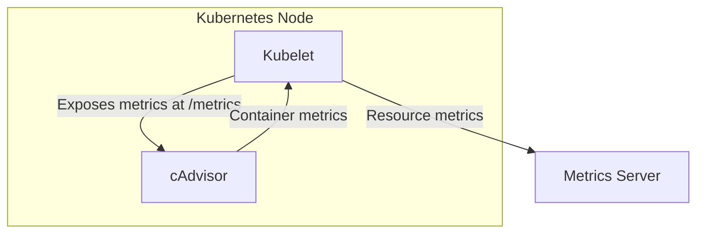

Metric Server is one of the most fundamental tools that every Kubernetes engineer should know. These resources aim to feed Horizontal Pod Autoscaler and Vertical Pod Autoscaler to make decisions on scaling by pulling in your Node and Pod level Metrics. 🚀

What does it do? 

→ Pulls real-time data on CPU usage

→ Tracks memory consumption

→ Collects network statistics

→ Aggregates all metrics

→ Stores everything in memory 

How does it actually work? 🔍

Kubernetes uses kubelet (an agent running on each node) which includes cAdvisor (Container Advisor).

cAdvisor → retrieves metrics from pods and nodes → exposes them through kubelet API → Metric Server collects this data

The best part? Once deployed, you can easily check metrics with simple commands:

kubectl top node: See node-level resource usage
kubectl top pod: Monitor pod-level consumption

No complex setup. No heavy overhead. Just the essential metrics you need to keep your Kubernetes environment running and scaling smoothly. 💯

Note: Metrics Server is meant only for autoscaling purposes. For example, don't use it to forward metrics to monitoring solutions, or as a source of monitoring solution metrics. In such cases please collect metrics from Kubelet /metrics/resource endpoint directly.

