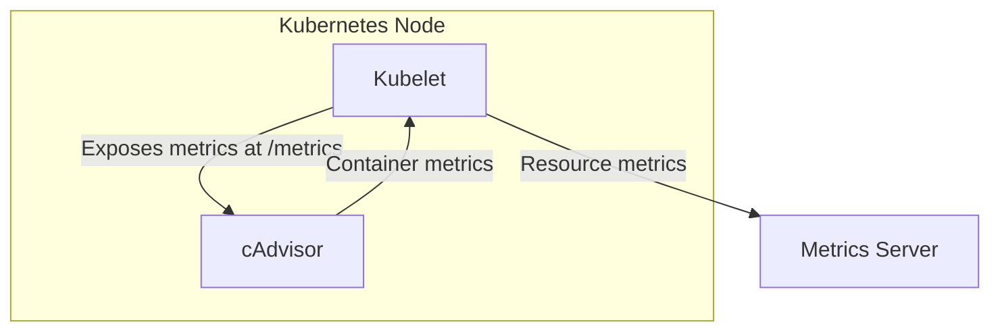

Metric Server is one of the most fundamental tools that every Kubernetes engineer should know. These resources aim to feed Horizontal Pod Autoscaler and Vertical Pod Autoscaler to make decisions on scaling by pulling in your Node and Pod level Metrics. 🚀

𝗪𝗵𝗮𝘁 𝗱𝗼𝗲𝘀 𝗶𝘁 𝗱𝗼?

→ Pulls real-time data on CPU usage

→ Tracks memory consumption

→ Collects network statistics

→ Aggregates all metrics

→ Stores everything in memory

𝗛𝗼𝘄 𝗱𝗼𝗲𝘀 𝗶𝘁 𝗮𝗰𝘁𝘂𝗮𝗹𝗹𝘆 𝘄𝗼𝗿𝗸? 🔍

Kubernetes uses kubelet (an agent running on each node) which includes cAdvisor (Container Advisor).

cAdvisor → retrieves metrics from pods and nodes → exposes them through kubelet API → Metric Server collects this data

𝗧𝗵𝗲 𝗯𝗲𝘀𝘁 𝗽𝗮𝗿𝘁? 𝗢𝗻𝗰𝗲 𝗱𝗲𝗽𝗹𝗼𝘆𝗲𝗱, 𝘆𝗼𝘂 𝗰𝗮𝗻 𝗲𝗮𝘀𝗶𝗹𝘆 𝗰𝗵𝗲𝗰𝗸 𝗺𝗲𝘁𝗿𝗶𝗰𝘀 𝘄𝗶𝘁𝗵 𝘀𝗶𝗺𝗽𝗹𝗲 𝗰𝗼𝗺𝗺𝗮𝗻𝗱𝘀:

𝗸𝘂𝗯𝗲𝗰𝘁𝗹 𝘁𝗼𝗽 𝗻𝗼𝗱𝗲: See node-level resource usage 

𝗸𝘂𝗯𝗲𝗰𝘁𝗹 𝘁𝗼𝗽 𝗽𝗼𝗱: Monitor pod-level consumption

No complex setup. No heavy overhead. Just the essential metrics you need to keep your Kubernetes environment running and scaling smoothly. 💯

𝗡𝗼𝘁𝗲 ⚠️ : Metrics Server is meant only for autoscaling purposes. For example, don't use it to forward metrics to monitoring solutions, or as a source of monitoring solution metrics. In such cases please collect metrics from Kubelet /𝘮𝘦𝘵𝘳𝘪𝘤𝘴/𝘳𝘦𝘴𝘰𝘶𝘳𝘤𝘦 endpoint directly.

