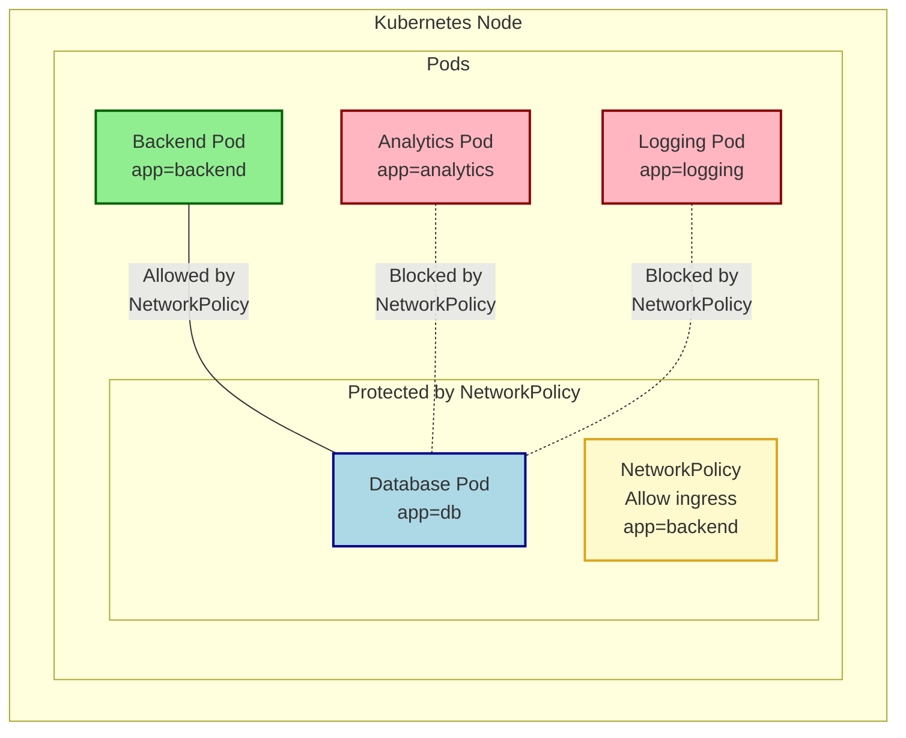

🔒 Security always requires some tweaking. When it comes to Pod Networking, all pods can communicate freely by default, but do you really want that? Do you want your frontend pod to talk directly to your database pod without any restrictions? 

Uncontrolled communication can pose significant security risks, especially in a microservices architecture where sensitive data is involved. Here comes NetworkPolicies in Kubernetes. 

𝗪𝗵𝗮𝘁 𝗮𝗿𝗲 𝗡𝗲𝘁𝘄𝗼𝗿𝗸 𝗣𝗼𝗹𝗶𝗰𝗶𝗲𝘀? 🛡️

→ NetworkPolicies are rules that define how pods can communicate with each other and with other network endpoints

→ They act like security guards, controlling both incoming (Ingress) and outgoing (Egress) traffic based on predefined rules

→ By default, without NetworkPolicies, all pods can freely communicate with each other - this is a security risk!

𝗛𝗼𝘄 𝗱𝗼 𝗡𝗲𝘁𝘄𝗼𝗿𝗸 𝗣𝗼𝗹𝗶𝗰𝗶𝗲𝘀 𝘄𝗼𝗿𝗸? 🔍

→ They use selectors to target specific pods based on labels, namespaces, or IP blocks (CIDR)

→ Policies are enforced by your Container Network Interface (CNI) plugin, so remember that not every CNI supports it. Policies will be created but not enforced if your CNI doesn't have the capability

→ Multiple policies are applied additively, not sequentially - if policies conflict, communication won't work

𝗕𝗲𝘀𝘁 𝗣𝗿𝗮𝗰𝘁𝗶𝗰𝗲𝘀 ✅

→ Follow the principle of least privilege - only allow necessary communication

→ Start with a "deny all" policy and then explicitly allow required connections

→ Use labels consistently to make policies more manageable

→ Test your policies thoroughly before applying them in production

𝙍𝙚𝙢𝙚𝙢𝙗𝙚𝙧: Security is not optional in today's world. NetworkPolicies are your first line of defense within the cluster! 🛡️ #Kubernetes #Security #DevOps

