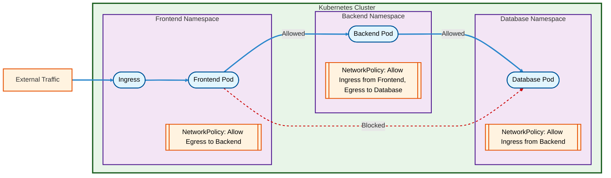
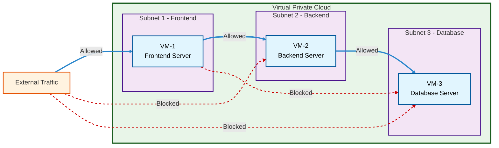

# Network Segmentation with netpol on Kubernetes Cluster

```mermaid
flowchart LR
  subgraph cluster[Kubernetes Cluster]
    direction TB
    subgraph frontend-ns[Frontend Namespace]
      frontend-pod([Frontend Pod])
      frontend-pol[[NetworkPolicy: Allow Egress to Backend]]
      ingress([Ingress])
    end

    subgraph backend-ns[Backend Namespace]
      backend-pod([Backend Pod])
      backend-pol[[NetworkPolicy: Allow Ingress from Frontend, Egress to Database]]
    end

    subgraph database-ns[Database Namespace]
      database-pod([Database Pod])
      database-pol[[NetworkPolicy: Allow Ingress from Backend]]
    end
  end

  internet[External Traffic] --> ingress
  ingress --> frontend-pod
  frontend-pod --> |Allowed| backend-pod
  backend-pod --> |Allowed| database-pod
  frontend-pod -.-> |Blocked| database-pod

  %% Styling matching the VM diagram color schema
  classDef podBox fill:#e1f5fe,stroke:#01579b,stroke-width:2px,color:#000;
  classDef policyBox fill:#fff3e0,stroke:#e65100,stroke-width:2px,color:#000;
  classDef namespaceBox fill:#f3e5f5,stroke:#4a148c,stroke-width:2px;
  classDef clusterBox fill:#e8f5e8,stroke:#1b5e20,stroke-width:3px;
  classDef external fill:#fff3e0,stroke:#e65100,stroke-width:2px;
  
  class frontend-pod,backend-pod,database-pod,ingress podBox;
  class frontend-pol,backend-pol,database-pol policyBox;
  class frontend-ns,backend-ns,database-ns namespaceBox;
  class cluster clusterBox;
  class internet external;
  
  %% Link styling for traffic flows
  linkStyle 0 stroke:#2986cc,stroke-width:3px;
  linkStyle 1 stroke:#2986cc,stroke-width:3px;
  linkStyle 2 stroke:#2986cc,stroke-width:3px;
  linkStyle 3 stroke:#2986cc,stroke-width:3px;
  linkStyle 4 stroke:#cc0000,stroke-width:2px,stroke-dasharray:5 5;


```

# Network Segmentation with subnet on Cloud with VMs

```mermaid

flowchart LR
    ext[External Traffic]
    
    %% Group subnets inside Virtual Private Cloud with VMs as boxes
    subgraph vNet [Virtual Private Cloud]
        direction LR
        
        subgraph sub1 [Subnet 1 - Frontend]
            vm1[VM-1<br/>Frontend Server]
        end
        
        subgraph sub2 [Subnet 2 - Backend]
            vm2[VM-2<br/>Backend Server]
        end
        
        subgraph sub3 [Subnet 3 - Database]
            vm3[VM-3<br/>Database Server]
        end
    end

    %% Allowed traffic flows (blue)
    ext -- "Allowed" --> vm1
    vm1 -- "Allowed" --> vm2
    vm2 -- "Allowed" --> vm3

    %% Blocked traffic flows (red)
    ext -. "Blocked" .-> vm2
    ext -. "Blocked" .-> vm3
    vm1 -. "Blocked" .-> vm3

    %% Styling for clarity
    classDef vmBox fill:#e1f5fe,stroke:#01579b,stroke-width:2px,color:#000;
    classDef subnetBox fill:#f3e5f5,stroke:#4a148c,stroke-width:2px;
    classDef vnetBox fill:#e8f5e8,stroke:#1b5e20,stroke-width:3px;
    classDef external fill:#fff3e0,stroke:#e65100,stroke-width:2px;
    
    class vm1,vm2,vm3 vmBox;
    class sub1,sub2,sub3 subnetBox;
    class vNet vnetBox;
    class ext external;
    
    %% Link styling
    linkStyle 0 stroke:#2986cc,stroke-width:3px;
    linkStyle 1 stroke:#2986cc,stroke-width:3px;
    linkStyle 2 stroke:#2986cc,stroke-width:3px;
    linkStyle 3 stroke:#cc0000,stroke-width:2px,stroke-dasharray: 5 5;
    linkStyle 4 stroke:#cc0000,stroke-width:2px,stroke-dasharray: 5 5;
    linkStyle 5 stroke:#cc0000,stroke-width:2px,stroke-dasharray: 5 5;


```
