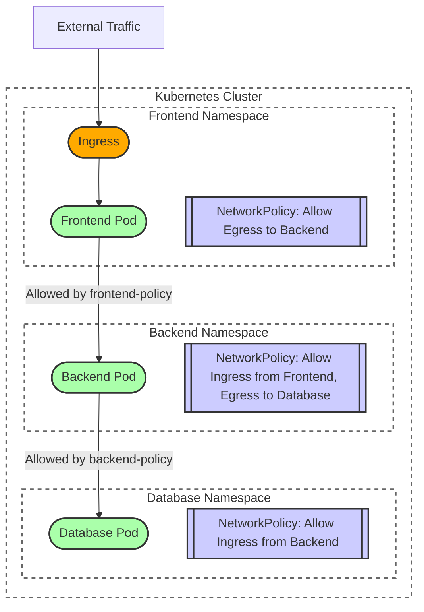
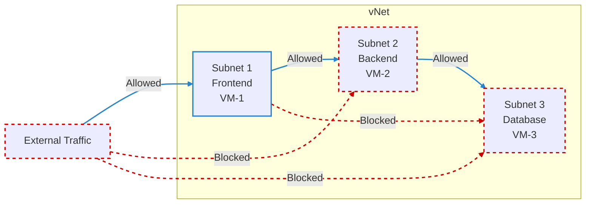

# Network Segmentation with netpol on Kubernetes Cluster

```mermaid

graph TB
  subgraph cluster[Kubernetes Cluster]
    subgraph frontend-ns [Frontend Namespace]
      frontend-pod([Frontend Pod]):::pod
      frontend-policy[[NetworkPolicy: Allow Egress to Backend]]:::policy
      ingress([Ingress]):::ingress
    end

    subgraph backend-ns [Backend Namespace]
      backend-pod([Backend Pod]):::pod
      backend-policy[[NetworkPolicy: Allow Ingress from Frontend, Egress to Database]]:::policy
    end

    subgraph database-ns [Database Namespace]
      database-pod([Database Pod]):::pod
      database-policy[[NetworkPolicy: Allow Ingress from Backend]]:::policy
    end
  end

  internet[External Traffic] --> ingress
  ingress --> frontend-pod
  frontend-pod --> |Allowed by frontend-policy| backend-pod
  backend-pod --> |Allowed by backend-policy| database-pod

  classDef pod fill:#aaffaa,stroke:#333,stroke-width:2px;
  classDef ingress fill:#ffaa00,stroke:#333,stroke-width:2px;
  classDef policy fill:#ccccff,stroke:#333,stroke-width:2px;
  classDef cluster fill:#fff,stroke:#666,stroke-width:2px,stroke-dasharray:5 5;


```

# Network Segmentation with subent on Cloud with VMs

```mermaid

flowchart LR
    ext[External Traffic]
    sub1[Subnet 1<br/>Frontend<br/>VM-1]
    sub2[Subnet 2<br/>Backend<br/>VM-2]
    sub3[Subnet 3<br/>Database<br/>VM-3]

    %% Group subnets inside vNet
    subgraph vNet [vNet]
        direction LR
        sub1
        sub2
        sub3
    end

    %% Allowed traffic flows (blue)
    ext -- "Allowed" --> sub1
    sub1 -- "Allowed" --> sub2
    sub2 -- "Allowed" --> sub3

    %% Blocked traffic flows (red)
    ext -. "Blocked" .-> sub2
    ext -. "Blocked" .-> sub3
    sub1 -. "Blocked" .-> sub3

    %% Styling for clarity
    classDef allowed stroke:#2986cc,stroke-width:2px;
    classDef blocked stroke:#cc0000,stroke-dasharray: 5 5,stroke-width:2px;
    class ext,sub1,sub2,sub3 allowed;
    class ext,sub2,sub3 blocked;
    linkStyle 0 stroke:#2986cc,stroke-width:2px;
    linkStyle 1 stroke:#2986cc,stroke-width:2px;
    linkStyle 2 stroke:#2986cc,stroke-width:2px;
    linkStyle 3 stroke:#cc0000,stroke-width:2px,stroke-dasharray: 5 5;
    linkStyle 4 stroke:#cc0000,stroke-width:2px,stroke-dasharray: 5 5;
    linkStyle 5 stroke:#cc0000,stroke-width:2px,stroke-dasharray: 5 5;

```
