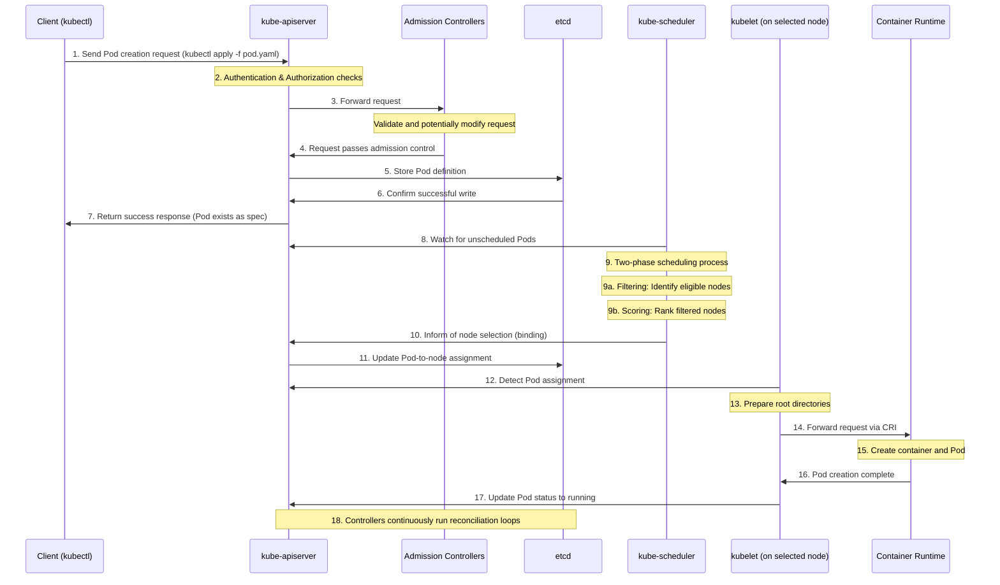

How exactly does Pod creation in Kubernetes work? There are numerous steps, ranging from updates to your key-value store to reconciliation, filtering, scoring, and so on. The first step is making the client-side request and triggering the API Server, which is when you run kubectl apply —f pod.yaml or use another client tool.

→ With that your created request goes to kube-apiserver which acts like a gatekeeper, checking your credentials and permissions before allowing the request to proceed basically taking care of authorization and authentication.

→ Admission controllers intercept the request, validating and potentially modifying it according to cluster policies until first rejection where the object is discarded. 

→ After validation, the API server stores the pod definition in etcd, which serves as the cluster's persistent storage database and source of truth.

→ ETCD returns a successful write to the API Server.  

→ The API server returns a response to the client indicating the pod resource has been created in etcd, though at this point it exists only as a specification.

→ The kube-scheduler constantly watches the API server for newly created pods without node assignments and discovers your unscheduled pod. Scheduler employs a sophisticated two-phase process for node selection to account for resource constraints, affinity/anti-affinity rules, node selectors and custom scheduling preferences:

→→ Filtering: Identifies nodes that meet the pod's requirements and constraints

→→ Scoring: Ranks the filtered nodes based on resource availability and other criteria

→ Once the scheduler selects the optimal node, it informs the API server about this decision through a binding operation.

→ The API server updates etcd with this pod-to-node assignment information, maintaining the desired state creating a drift from the actual state. 

→ The kubelet on the selected node detects that a pod has been assigned to it and begins the creation process by preparing the necessary root directories for the Pod and then rorwards the request to the container runtime via the Container Runtime Interface (CRI) which uses the pod specification to create the container and Pod. 

→ Once done, your Pod is in running state and with that various controllers in the Controller Manager continuously run reconciliation loops to ensure the actual state matches the desired state

If this sounds interesting, don't forget to follow @hrittikhere because I will be posting about Optimistic Concurrency in Kubernetes tomorrow discussing controller prioritisation.

