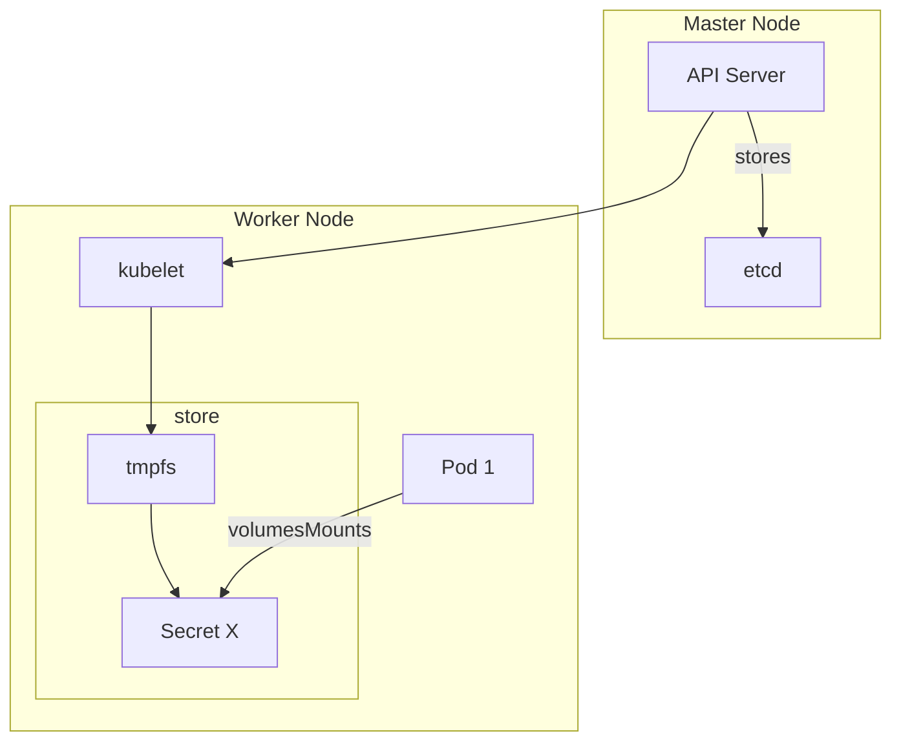

Kubernetes Secrets are important, but do you know a few facts about how Kubernetes treats them with a spectrum of importance like SATS, even though it's similar to ConfigMaps? The strategy lies in how the API Server shares them with the requested Pod.

→  A secret is only sent to a node if a Pod on that node requires it, but it remains in ETCD unencrypted by default. That's why a good practice is to encrypt it at rest and configure RBAC to protect the API Server from unauthorised access.

→ When the Pod requires it, so the linkage happens through secretKeyRef either via volume or environment variables 

→  Kubelet stores the secret in a tmpfs so that the secret is not written to disk storage, as shown in the diagram.

→  When the Pod that relies on the secret is removed, kubelet will also eliminate its local copy of the secret data including the linkage and the secret data. 

Learn more in the official docs: https://kubernetes.io/docs/concepts/configuration/secret/#information-security-for-secrets

