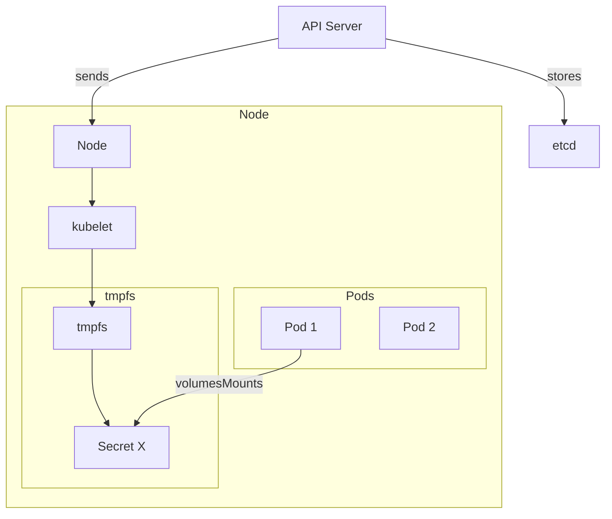

```mermaid
graph TD
    A[API Server] --> |stores| B[etcd]
    A --> |sends| C[Node]
    
    subgraph "Node"
        C --> D[kubelet]
        D --> E[tmpfs]
        
        subgraph "tmpfs"
            E --> F[Secret X]
        end
        
        subgraph "Pods"
            G[Pod 1] --> |volumesMounts| F
            H[Pod 2]
        end
    end


```
