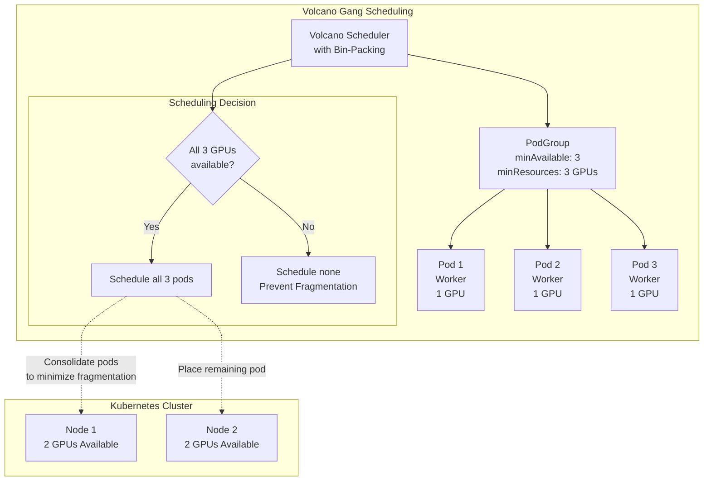

Scheduling in Kubernetes happens in various ways. Depending on the workload, you might need different algorithms like 𝗚𝗮𝗻𝗴 𝗦𝗰𝗵𝗲𝗱𝘂𝗹𝗶𝗻𝗴. Volcano, a CNCF project, supports this and can optimize complex workflows such as AI training, inference pipelines, and distributed data processing.  


🚀 𝗪𝗵𝗮𝘁 𝗶𝘀 𝗚𝗮𝗻𝗴 𝗦𝗰𝗵𝗲𝗱𝘂𝗹𝗶𝗻𝗴?
Gang scheduling ensures all pods in a group ("gang") start simultaneously – or none do. This prevents partial execution, which is critical for interdependent tasks like distributed training or multi-stage AI pipelines. Without it, a single delayed pod could stall an entire workflow, wasting resources.

𝗘𝘅𝗮𝗺𝗽𝗹𝗲: In distributed AI training, if 10 worker pods are needed, Volcano’s gang scheduler waits until all 10 are available. If even one fails to schedule, the scheduler releases reserved resources to avoid cluster deadlocks.

⚡ 𝗪𝗵𝘆 𝗩𝗼𝗹𝗰𝗮𝗻𝗼?
Volcano extends Kubernetes’ default scheduler to handle batch workloads and multi-pod dependencies. It’s ideal for:

→ AI/ML workflows (e.g., TensorFlow/PyTorch jobs).

→ Big Data processing (Spark, Flink).

→ High-performance computing (HPC).

Key features:
✅ PodGroup orchestration: Treats multiple pods as a single schedulable unit.
✅ Fair-share resource allocation: Balances cluster resources across teams.
✅ Preemption/Reclaim: Prioritizes critical workloads without manual intervention.

🌟 𝗥𝗲𝗮𝗹-𝗪𝗼𝗿𝗹𝗱 𝗨𝘀𝗲 𝗖𝗮𝘀𝗲
Imagine training a large language model (LLM) across 100 GPUs. With gang scheduling:

→ Volcano groups all worker pods into a PodGroup.

→ The scheduler reserves resources only when all 100 GPUs are available.

→ If a node fails, Volcano retries or releases resources instantly, avoiding idle clusters.

This eliminates "resource hoarding" and ensures cost-efficient scaling for AI teams. 


```
